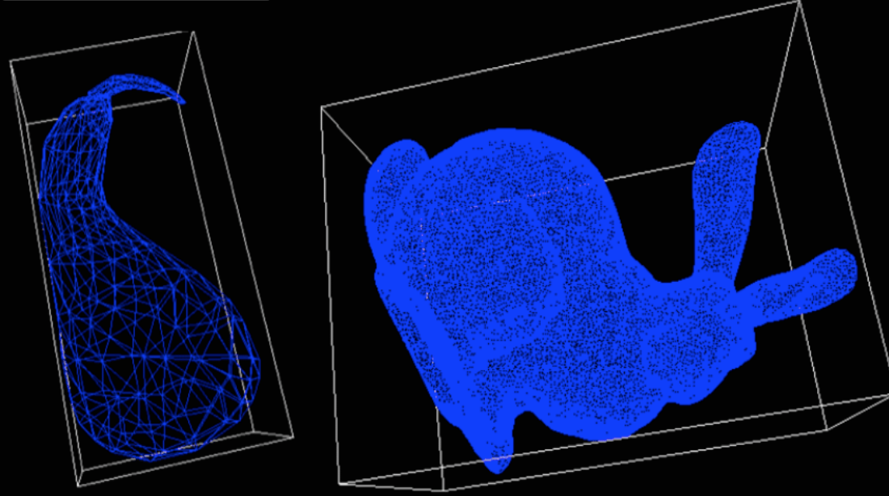

# Oriented Bounding Box 
Uses Principal Component Analysis to generate oriented bounded boxes.

In acceleration data structures such as the Bounding Volume Hierarchy, the design of the bounding boxes themselves play a integral role in quickly determining intersection between objects. An axis aligned bounding box, while simple to build and easy to test for intersection with, does not necessarily fit the objects in it tightly and thus increases the chances of false positive intersections. Oriented bounding boxes reduce the possibility of such false positives by fitting objects they store more tightly. This is achieved by aligning the boxes along the principal axes of the objects. 

Note: Requires Eigen 3.2.4 and assumes it is in /usr/local/Cellar/eigen/3.2.4/include/eigen3/
